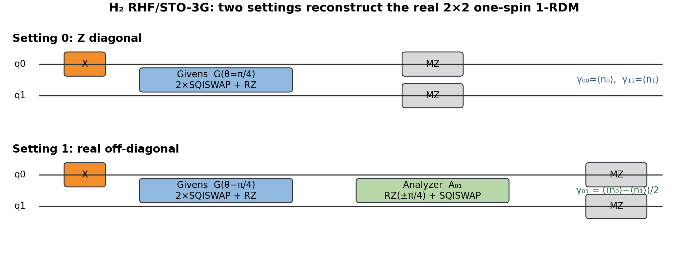
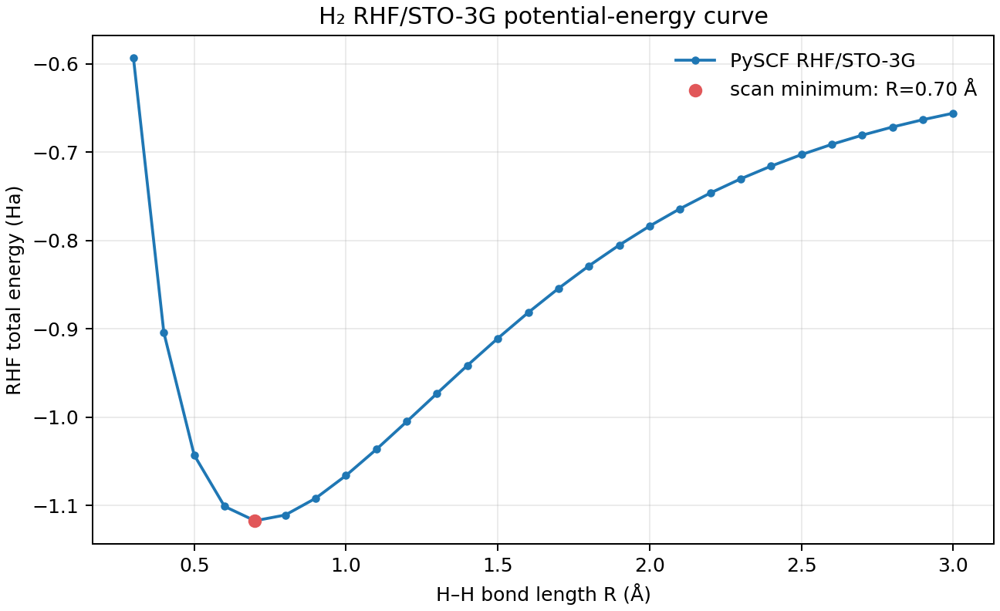

# H₂ Hartree–Fock 量子复现：电路、1‑RDM、能量与 Gaussian 对照

## 一句话结论

这套工程用 **2 个量子比特、2 条测量线路**重构 H₂ 的实 \(2\times2\) 单自旋 1‑RDM，再用同一套 STO‑3G 分子积分计算 RHF 总能量；在 \(R=0.7414\) Å 时，理想闭环得到

\[
E_Q=-1.116684387085\ {\rm Ha},
\]

与 PySCF RHF 在机器精度内一致，并可用附带的 Gaussian 输入独立核对。

---

## 1. 这套方案究竟复现什么

完整闭环是：

\[
\boxed{\text{H₂ 几何 + STO-3G}}
\rightarrow
\boxed{\text{经典 RHF 与分子积分}}
\rightarrow
\boxed{\text{Givens 量子态制备}}
\rightarrow
\boxed{\text{两 setting 测量}}
\rightarrow
\boxed{\gamma_Q}
\rightarrow
\boxed{E_{\rm RHF}[\gamma_Q]}
\rightarrow
\boxed{\text{Gaussian 对照}}.
\]

默认定义如下：

| 项目 | 本工程固定值 |
|---|---|
| 分子 | 中心对称的 H₂ |
| 键长 | \(R=0.7414\) Å |
| 电荷/多重度 | `0 1` |
| 经典方法 | Restricted Hartree–Fock，RHF |
| 基组 | STO‑3G |
| 轨道基 | Löwdin 正交化 AO 基，\(X=S^{-1/2}\) |
| 主量子编码 | 2 qubits、1 particle，表示一个自旋分量 |
| RHF 自旋处理 | \(\alpha\) 与 \(\beta\) 使用同一个空间 1‑RDM |
| 原生门 | `X`、`RZ`、`SQISWAP` |
| RZ 单位 | **弧度** |
| SQISWAP 约定 | 单粒子子空间为 \(2^{-1/2}\begin{pmatrix}1&i\\i&1\end{pmatrix}\) |
| JSON bit 顺序 | 默认左到右为 `q[1]q[0]` |

H₂ 的 HF 经典计算很容易，因此这不是量子优势演示。它的价值是作为 H₈ 之前的最小校准样例：每一个门、矩阵元和能量项都能手算和独立交叉检查。

---

## 2. 为什么只需要 2 个量子比特

STO‑3G 对 H₂ 给出 2 个空间基函数。闭壳层 RHF 有 2 个电子：

- 一个 \(\alpha\) 电子占据成键空间轨道；
- 一个 \(\beta\) 电子占据同一个空间轨道。

因此只需在一个自旋分量上编码：

\[
2\ \text{空间轨道}\quad+\quad1\ \text{电子}
\quad\Longrightarrow\quad
2\ \text{qubits},\ 1\ \text{particle}.
\]

测得单自旋空间 1‑RDM 后，RHF 能量公式自动把两种自旋计入。`circuits/four_qubit_optional/` 也提供了显式的 4 qubits、2 particles 版本，但主复现应优先用 2 qubits，以减少门数和噪声。

---

## 3. 从 Gaussian/PySCF 轨道到量子态

### 3.1 为什么不能直接编码 Gaussian 的 AO 密度矩阵

Gaussian 原子轨道 \(\{\chi_\mu\}\) 一般不正交：

\[
S_{\mu\nu}=\langle\chi_\mu|\chi_\nu\rangle\neq\delta_{\mu\nu}.
\]

量子比特表示的费米模式必须是正交模式。因此先做 Löwdin 正交化：

\[
X=S^{-1/2},\qquad
|\widetilde\chi_p\rangle=\sum_\mu|\chi_\mu\rangle X_{\mu p}.
\]

若经典 RHF 占据轨道在 AO 基中的系数是 \(C_{\rm AO}\)，则正交基系数为：

\[
C_{\rm orth}=X^{-1}C_{\rm AO}.
\]

本工程把 \(S,X,C_{\rm AO},C_{\rm orth}\)、一电子积分和二电子积分全部保存在：

```text
reference/h2_r0.7414_sto3g_reference.json
reference/h2_r0.7414_sto3g_reference.npz
```

### 3.2 H₂ 的占据轨道与 Givens 角

在中心对称 H₂ 的 Löwdin 基中，RHF 占据轨道是对称组合：

\[
\mathbf c=
\begin{pmatrix}
1/\sqrt2\\
1/\sqrt2
\end{pmatrix}.
\]

以模式占据顺序 \(|n_0n_1\rangle_{\rm mode}\) 书写：

\[
|\psi_\sigma\rangle
=\cos\theta|10\rangle_{\rm mode}
+\sin\theta|01\rangle_{\rm mode},
\qquad
\theta=\arctan2(c_1,c_0)=\frac{\pi}{4}.
\]

注意：平台 JSON 默认写成 `q[1]q[0]`，所以模式态 \(|10\rangle_{\rm mode}\) 对应返回字符串 `"01"`。

---

## 4. 量子线路



### 4.1 态制备

先用 `X q[0]` 制备单粒子参考态，再施加实 Givens 旋转：

\[
G(\theta)=
\begin{pmatrix}
\cos\theta&-\sin\theta\\
\sin\theta& \cos\theta
\end{pmatrix}.
\]

在本工程的 \(+i\) `SQISWAP` 约定下，以下原生序列严格实现 \(G(\theta)\)：

```text
SQISWAP q[1],q[0]
RZ q[0],(pi + theta)
RZ q[1],(-theta)
SQISWAP q[1],q[0]
RZ q[0],(pi)
```

代入 \(\theta=\pi/4\) 后，完整态制备是：

```text
X q[0]
SQISWAP q[1],q[0]
RZ q[0],(3.926990816987)
RZ q[1],(-0.785398163397)
SQISWAP q[1],q[0]
RZ q[0],(3.141592653590)
```

可直接提交的门文件：

```text
circuits/gate_body_radians/H2-00-z-diagonal.txt
circuits/gate_body_radians/H2-01-real-offdiagonal.txt
```

带 `QINIT/CREG/MEASURE` 的完整文件位于：

```text
circuits/originir_full/
```

### 4.2 Setting 0：测对角元

态制备后直接进行 Z 基测量：

\[
\gamma_{00}=\langle n_0\rangle,\qquad
\gamma_{11}=\langle n_1\rangle.
\]

理想 H₂ 结果：

\[
P("01")=P("10")=\frac12.
\]

### 4.3 Setting 1：测实非对角元

在同一态制备后追加：

```text
RZ q[0],(0.785398163397)
RZ q[1],(-0.785398163397)
SQISWAP q[1],q[0]
```

它把实相干项映射为占据数差：

\[
\operatorname{Re}\gamma_{01}
=\frac{\langle n_0\rangle-\langle n_1\rangle}{2}.
\]

H₂ RHF 波函数可取实数，因此这两条 setting 已足以重构：

\[
\gamma=
\begin{pmatrix}
\gamma_{00}&\gamma_{01}\\
\gamma_{01}&\gamma_{11}
\end{pmatrix}.
\]

理想分析器输出 `"01"` 的概率为 1，因此 \(\gamma_{01}=1/2\)。

---

## 5. 如何由 1‑RDM 计算 Hartree–Fock 能量

本工程的 \(\gamma\) 是单自旋空间 1‑RDM，满足理想 RHF Slater 条件：

\[
\gamma^\dagger=\gamma,\qquad
\operatorname{Tr}\gamma=1,\qquad
\gamma^2=\gamma.
\]

在实正交轨道基中，闭壳层 RHF 总能量为：

\[
\begin{aligned}
E_{\rm RHF}[\gamma]
=&\ E_{\rm nuc}
+2\sum_{pq}h_{pq}\gamma_{pq}\\
&+2\sum_{pqrs}\gamma_{pq}\gamma_{rs}(pq|rs)
-\sum_{pqrs}\gamma_{pq}\gamma_{rs}(pr|qs).
\end{aligned}
\]

三个电子项分别是：

1. 一电子动能与核吸引；
2. Coulomb 直接项；
3. exchange 交换项。

在 \(R=0.7414\) Å 的理想数据上：

| 能量项 | 数值 / Ha |
|---|---:|
| 核排斥 \(E_{\rm nuc}\) | \(+0.713753993688\) |
| 一电子项 | \(-2.504927147130\) |
| Coulomb 项 | \(+1.348977532714\) |
| exchange 项（被减去） | \(+0.674488766357\) |
| RHF 总能量 | \(-1.116684387085\) |

### 原始能量与投影后能量

有限 shots 或噪声会使原始 \(\gamma_{\rm raw}\) 不再严格幂等。程序同时报告：

- `raw`：直接把测量矩阵代入 HF 泛函；
- `rank-1 projected`：把矩阵投影到最近的 1 粒子 Slater projector 后再算。

原始非物理矩阵的能量可能低于 Gaussian RHF，不能把它误解为“优于 HF”；RHF 变分上界只对合法 Slater 行列式成立。投影后能量是主要分子级指标，原始值保留用于诊断。

---

## 6. 目录结构

```text
H2_HF_Reproduction/
├── README.md
├── requirements.txt
├── requirements-chemistry.txt
├── code/
│   ├── h2_core.py
│   ├── build_reference.py
│   ├── generate_circuits.py
│   ├── simulate_counts.py
│   ├── analyze_results.py
│   ├── generate_gaussian_inputs.py
│   ├── parse_gaussian.py
│   ├── scan_curve.py
│   ├── make_circuit_figure.py
│   └── run_demo.py
├── tests/run_tests.py
├── circuits/
│   ├── gate_body_radians/
│   ├── originir_full/
│   └── four_qubit_optional/
├── data/
│   ├── example_ideal_counts/
│   └── platform_json_template.json
├── reference/
├── gaussian/
│   ├── RUN_GAUSSIAN.md
│   ├── inputs/
│   └── scan_inputs/
├── results_demo/
└── results_scan/
```

---

## 7. 最快复现：不需要 Gaussian，也不需要 PySCF

预计算的同基分子积分已经包含在包中。

### Step 1：创建 Python 环境

Linux/macOS：

```bash
python -m venv .venv
source .venv/bin/activate
python -m pip install -r requirements.txt
```

Windows PowerShell：

```powershell
python -m venv .venv
.\.venv\Scripts\Activate.ps1
python -m pip install -r requirements.txt
```

### Step 2：运行确定性测试

```bash
python tests/run_tests.py
```

应看到 4 个测试全部通过：

1. `SQISWAP-RZ` 原生编译确实等于目标 Givens 旋转；
2. 两条 setting 能精确重构 \(2\times2\) 1‑RDM；
3. 1‑RDM 能量泛函闭合到 PySCF RHF；
4. Gaussian `SCF Done` 解析正确。

### Step 3：运行完整理想闭环

```bash
python code/run_demo.py --shots 10000 --bootstrap 2000
```

预期核心输出：

```text
pyscf_rhf_hartree       = -1.116684387085341
raw_quantum_hartree     = -1.116684387085341
projected_quantum       = -1.116684387085340
circuit_level_pass      = true
```

主要结果位于：

```text
results_demo/summary.json
results_demo/energy_summary.csv
results_demo/gamma_raw.csv
results_demo/gamma_projected_rank1.csv
results_demo/gamma_comparison.png
results_demo/energy_comparison.png
```

若希望看到真实有限 shots 的随机涨落：

```bash
python code/run_demo.py --shots 1000 --bootstrap 2000 --sample
```

合成数据只能用于管线演练，不能标成真机结果。

---

## 8. 用你自己的量子平台数据复现

### Step 1：提交两条线路

提交：

```text
circuits/gate_body_radians/H2-00-z-diagonal.txt
circuits/gate_body_radians/H2-01-real-offdiagonal.txt
```

建议每条至少 5,000–10,000 shots。H₂ 很小，优先增加 shots，而不是增加原子数。

### Step 2：保存返回数据

把两份文件命名为：

```text
my_data/z_diagonal.json
my_data/real_offdiagonal.json
```

推荐 counts 格式：

```json
{
  "status": "Completed",
  "shots": 10000,
  "result": {
    "key": ["00", "01", "10", "11"],
    "value": [2, 4930, 5064, 4],
    "value_type": "counts"
  }
}
```

程序也接受：

- `counts: {"01": 4930, ...}`；
- `probabilities: {"01": 0.493, ...}`；
- 前面 H₈ 平台的 `result.key/result.value` 概率格式。

若只有概率且文件没有 shots，必须显式添加 `--shots 1000`；对于恰好为 0.5 的概率，不能仅凭小数值可靠反推出真实 shots。

### Step 3：运行分析

```bash
python code/analyze_results.py \
  --input-dir my_data \
  --reference reference/h2_r0.7414_sto3g_reference.npz \
  --output-dir my_results \
  --bootstrap 2000 \
  --seed 5210
```

若平台 bitstring 左边是 `q[0]`，改为：

```bash
python code/analyze_results.py \
  --input-dir my_data \
  --bit-order q0q1 \
  --reference reference/h2_r0.7414_sto3g_reference.npz \
  --output-dir my_results
```

### Step 4：程序实际做的处理

1. 验证任务状态、bitstring、非负性、counts/probabilities 总和；
2. 按 Hamming weight \(=1\) 做粒子数后选择；
3. 计算每条 setting 的粒子数通过率；
4. 从 Z setting 得到 \(\gamma_{00},\gamma_{11}\)；
5. 从干涉 setting 得到 \(\gamma_{01}\)；
6. 检查 trace、Hermiticity、本征值和幂等误差；
7. 求最近的 rank‑1 Slater projector；
8. 用同一套 \(h_{pq},(pq|rs),E_{\rm nuc}\) 计算 raw/projected HF 能量；
9. 围绕观测分布做 multinomial bootstrap，给出 95% 能量区间；
10. 若提供 Gaussian log，同时计算量子–Gaussian 能量差。

---

## 9. 如何重建经典分子参考

这一步需要 PySCF：

```bash
python -m pip install -r requirements-chemistry.txt
```

重新生成 \(R=0.7414\) Å 的积分、轨道、1‑RDM 与能量：

```bash
python code/build_reference.py \
  --bond-length 0.7414 \
  --output-npz reference/rebuilt_reference.npz \
  --output-json reference/rebuilt_reference.json
```

程序内部执行：

1. `scf.RHF(molecule).kernel()`；
2. \(S^{-1/2}\) Löwdin 正交化；
3. 一电子/二电子积分变换；
4. 占据轨道系数与 \(\theta\) 提取；
5. 由 \(\gamma\) 重算 RHF 总能量；
6. 要求该能量与 SCF 输出相差小于 \(10^{-10}\) Ha。

PySCF 官方 quickstart 也说明了 `scf.RHF(...).kernel()` 的基本用法以及 MO 系数、占据数和积分访问方式：

<https://pyscf.org/quickstart.html>

---

## 10. Gaussian 怎么跑、应该比较什么

主输入已生成：

```text
gaussian/inputs/h2_R0p7414_RHF_STO3G.gjf
```

内容核心是：

```text
#p RHF/STO-3G SP SCF=(Tight,Conver=10) Pop=Full NoSymm

0 1
H  0.0000000000  0.0000000000  -0.3707000000
H  0.0000000000  0.0000000000   0.3707000000
```

Linux/集群通常运行：

```bash
cd gaussian/inputs
g16 < h2_R0p7414_RHF_STO3G.gjf > h2_R0p7414_RHF_STO3G.log
formchk h2_R0p7414_RHF_STO3G.chk h2_R0p7414_RHF_STO3G.fchk
cd ../..
```

Gaussian 输出中搜索：

```text
SCF Done:  E(RHF) = ...
```

自动加入量子对比：

```bash
python code/analyze_results.py \
  --input-dir my_data \
  --reference reference/h2_r0.7414_sto3g_reference.npz \
  --gaussian-log gaussian/inputs/h2_R0p7414_RHF_STO3G.log \
  --output-dir my_results_with_gaussian
```

真正应该报告：

| 层级 | 比较量 | 本工程指标 |
|---|---|---|
| 经典交叉检查 | PySCF RHF vs Gaussian RHF | \(|E_{\rm PySCF}-E_{\rm G}|\) |
| 量子原始结果 | raw 1‑RDM 能量 vs Gaussian | \(E_{\rm raw}-E_{\rm G}\) |
| 量子物理投影 | rank‑1 能量 vs Gaussian | \(E_{\rm proj}-E_{\rm G}\) |
| 状态层 | 量子 1‑RDM vs RHF 1‑RDM | Frobenius error、orbital fidelity |
| 硬件层 | 粒子数与统计 | \(P(N=1)\)、bootstrap 95% CI |

不要用 FCI 能量作为这套线路的首要标准，因为线路制备的是 HF Slater 行列式。Gaussian 的 HF 关键词说明也明确把 RHF 能量写在 `SCF Done: E(RHF)` 行：

<https://gaussian.com/hf/>

Gaussian 的 `formchk` 用于把二进制 checkpoint 转成可供其他软件读取的 formatted checkpoint：

<https://gaussian.com/formchk/>

更详细步骤见：

```text
gaussian/RUN_GAUSSIAN.md
```

---

## 11. 键长扫描与最直观可视化

生成 PySCF RHF 曲线以及逐点 Gaussian 输入：

```bash
python code/scan_curve.py \
  --lengths 0.30:3.00:0.10 \
  --output-dir results_scan \
  --gaussian-input-dir gaussian/scan_inputs
```

输出：

```text
results_scan/h2_rhf_sto3g_curve.csv
results_scan/h2_rhf_sto3g_curve.png
gaussian/scan_inputs/*.gjf
```



一个重要但容易误解的结果是：对中心对称 H₂/STO‑3G，在每个 \(R\) 自己的 Löwdin 基中，占据轨道始终是对称组合，所以

\[
\theta(R)=\frac{\pi}{4}.
\]

也就是说，这个特殊 H₂ 示例中改变 \(R\) 时，量子态制备线路不变；势能曲线变化来自 \(h_{pq}(R)\)、\((pq|rs)(R)\) 和 \(E_{\rm nuc}(R)\) 的变化。对 H₄/H₈ 或非对称分子，Givens 参数通常会随几何改变。

---

## 12. 成功标准

程序给出两层判定，避免把“电路跑对”和“分子能量跑对”混在一起。

### 电路/状态层

默认建议：

\[
P(N=1)\ge0.95,\qquad
F_{\rm orbital}\ge0.99.
\]

同时检查：

\[
\operatorname{Tr}\gamma\approx1,\qquad
\|\gamma^2-\gamma\|_F\ \text{较小}.
\]

### 分子能量层

主要比较投影后量子能量与 Gaussian RHF：

\[
\Delta E=E_{\rm proj}-E_{\rm Gaussian}^{\rm RHF}.
\]

把

\[
|\Delta E|\le1\ {\rm kcal/mol}
\approx1.5936\ {\rm mHa}
\]

作为直观目标；它是常用“chemical accuracy”尺度，不是硬件成功的唯一标准。必须同时报告 shots、置信区间和粒子数通过率。

Gaussian 与 PySCF 两个经典程序在同输入下应先满足：

\[
|E_{\rm Gaussian}-E_{\rm PySCF}|\lesssim10^{-6}\ {\rm Ha}.
\]

若经典基准自身不一致，先检查几何、单位、基组、charge/multiplicity 和是否误用了 UHF/DFT。

---

## 13. 常见故障

### 1. 把角度标签当成 \(\theta/\pi\)

本工程所有 `RZ` 数字已经是**显式弧度**。不要再乘 \(\pi\)。

### 2. SQISWAP 相位相反

如果平台实现的是 \(-i\) 而不是 \(+i\) `SQISWAP`，非对角元符号会改变。理想 real-offdiagonal 线路应几乎全输出 `"01"`；若几乎全是 `"10"`，先查门定义而不是直接改能量公式。

### 3. bit 顺序反了

默认 `"01"` 表示 q[0] 被占据。若平台相反，使用 `--bit-order q0q1`。对称 H₂ 的对角元恰好都是 0.5，仅看 Z setting 发现不了反序；必须结合 real-offdiagonal setting。

### 4. 原始能量低于 Gaussian HF

通常是 \(\gamma_{\rm raw}\) 非幂等；这不违反变分原理，因为它不是合法 Slater projector。查看 rank‑1 projected 能量。

### 5. Gaussian 与 PySCF 差很多

逐项核对：

- 两个 H 是否相距 0.7414 Å，而不是各自坐标写成 \(\pm0.7414\)；
- 单位是否 Angstrom；
- 是否都是 `RHF/STO-3G`；
- 是否都是 `0 1`；
- 比较的是否为含核排斥的总能量；
- 是否误拿 orbital energy 或 electronic energy 与总能量比较。

### 6. 改 \(R\) 后为什么电路角仍是 \(\pi/4\)

这是同核双原子分子的交换对称性，不是程序漏更新。积分和总能量会改变；更大氢链的多个轨道旋转角一般会改变。

---

## 14. 结果边界与推荐汇报方式

建议最终只放三张主图/表：

1. 两条量子线路；
2. \(\gamma_{\rm target},\gamma_{\rm raw},\gamma_{\rm projected}\) 热图；
3. PySCF/Gaussian/quantum raw/quantum projected 的能量误差图。

结论应按数据来源写：

- 使用包内理想 JSON：称为“理想闭环验证”；
- 使用随机模拟 JSON：称为“有限 shots 管线演练”；
- 使用真实后端且保留后端、校准、shots、原始 counts：才称为“真机复现”。

Google Quantum AI 的 HFVQE 复现页面同样以 basis-rotation circuit、1‑RDM 估计、post-selection 与 purification 为核心：

<https://quantumai.google/cirq/experiments/hfvqe>

原论文与补充材料：

<https://arxiv.org/abs/2004.04174>
