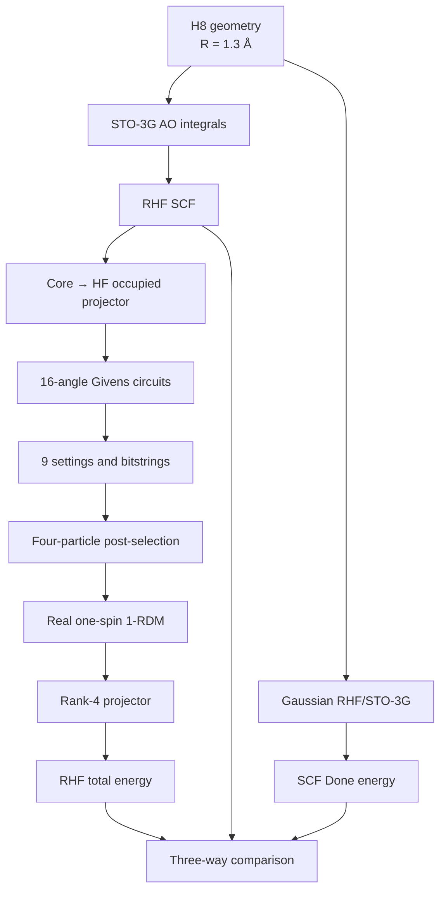

# 线性 H₈ Hartree–Fock 量子线路复现

> **一句话结论：** 本工程把“真实 H₈/STO‑3G 分子 → RHF 占据子空间 → 9 条量子测量线路 → 1‑RDM → Hartree–Fock 总能量 → Gaussian 对照”闭合为同一条可审计数据链，避免再把随机 Slater 态的电路复现误写成 H₈ 分子能量复现。

## 0. 这次复现到底证明什么

本工程的主观测量量是 H₈ 的 **RHF 总能量**。默认体系为：

- 线性、等间距 H₈；
- 相邻 H–H 距离 \(R=1.3000\ \text{Å}\)；
- 中性单重态，Gaussian 电荷/多重度为 `0 1`；
- `RHF/STO-3G`；
- 8 个空间轨道、8 个电子；
- 量子侧利用 RHF 的 \(\alpha/\beta\) 空间轨道相同，只显式编码一个自旋分量：8 qubits、4 particles。

必须区分三种结论：

1. **解析积分/RHF 闭合**：包内独立实现 STO‑3G 积分与 RHF，给出分子级经典参考；
2. **理想量子线路闭合**：9 条线路的精确概率重构同一个分子 1‑RDM 和 RHF 能量；
3. **有限 shots/真机性能**：由实际 counts 决定，不能由理想线路通过直接推出。

它不是相关能量（FCI、CCSD）计算，也不声称 RHF 是 H₈ 在 \(R=1.3\ \text{Å}\) 处的精确非相对论基态能量。

## 1. 已生成的关键结果

| 项目 | 结果 |
|---|---:|
| 包内解析 RHF 参考 | \(-3.9025797872882357\) Ha |
| 1‑RDM 能量式与 SCF 闭合误差 | \(3.55\times10^{-15}\) Ha |
| 量子设置数 | 9（1 条对角＋8 条非对角） |
| 每条线路 | 16 Givens = 32 `SQISWAP` + 48 `RZ`，另有 4 个 `X` |
| 理想重构最大 1‑RDM 元素误差 | \(3.66\times10^{-15}\) |
| 理想重构能量误差 | 数值精度内为 0 |
| 固定种子 1000-shots 投影后能量 | \(-3.8960753877232044\) Ha |
| 固定种子 1000-shots 投影后误差 | \(+6.5044\) mHa |
| 固定种子 1000-shots Slater 保真度 | 0.994930 |

1000-shots 示例的 raw 1‑RDM 不满足幂等性，直接代入能量式得到
\(-3.923191565921183\) Ha，低于 RHF 极小值。这不是“量子结果优于 HF”，而是把不可表示的噪声矩阵当作 Slater 1‑RDM 后得到的非物理解。rank‑4 投影恢复了合法 Slater 行列式，并恢复 RHF 变分上界。

完整机器可读结果位于：

- `results/KEY_RESULTS.json`
- `results/exact/summary.json`
- `results/sample_1000_shots/summary.json`
- `results/sample_1000_shots/bootstrap.json`
- `results/shot_planning.csv`

## 2. 目录结构

```text
H8_HF_Reproduction/
├── README.md
├── PARAMETER_PROVENANCE.csv       # 所有固定/分析参数的来源和得出过程
├── FORMULA_PROVENANCE.csv         # 数学操作、公式、理论依据、代码位置
├── DATA_LINEAGE.csv               # 原始参数到最终结果的逐阶段数据流
├── RUN_METADATA.json              # 运行环境、shots、随机种子
├── SHA256SUMS.csv                 # 文件大小与 SHA-256
├── requirements.txt
├── run_all.sh
├── code/
│   ├── run_all.py                 # 从几何开始的一键完整重跑
│   ├── process_platform_data.py   # 处理用户/平台的 9 份 JSON
│   ├── verify_hashes.py           # 校验 SHA256SUMS.csv
│   └── h8hf/
│       ├── integrals.py           # STO-3G 解析积分
│       ├── rhf.py                 # RHF/DIIS 与能量泛函
│       ├── circuits.py            # 菱形 Givens、测量网络、原生门编译
│       ├── sampling.py            # 精确概率、shots、bootstrap、shots 规划
│       ├── data_processing.py     # 后选择、1-RDM、rank-4 投影、能量
│       └── gaussian.py            # Gaussian 输入和 SCF Done 解析
├── gaussian/
│   ├── inputs/H8_R1p3000_RHF_STO3G.gjf
│   └── outputs/                   # 放入此前 Gaussian .log/.out
├── circuits/
│   ├── manifest.json              # 每条线路全部角度、配对和闭合误差
│   ├── abstract/                  # X + GIVENS
│   └── native/                    # X + RZ + SQISWAP
├── data/
│   ├── exact_probabilities/
│   └── sample_1000_shots/
├── reference/                     # 积分、轨道、参考 1-RDM、SCF 轨迹
├── results/
└── tests/
```

## 3. 一键重跑

需要 Python 3.10+、NumPy 和 SciPy：

```bash
python3 -m pip install -r requirements.txt
bash run_all.sh
```

`run_all.sh` 会依次：

1. 从 H₈ Cartesian 几何计算 STO‑3G AO 积分；
2. 做 RHF 自洽场；
3. 建立 core‑orbital 初始基；
4. 为 9 个 setting 分别求 16 个 Givens 角；
5. 输出抽象线路和 `X/RZ/SQISWAP` 原生线路；
6. 生成精确概率和固定种子的 1000-shots 示例；
7. 重构 raw/projected 1‑RDM 与能量；
8. 完成 2000 次 bootstrap 和 shots 规划；
9. 运行 7 项自动测试。

所有脚本都以脚本文件位置解析工程根目录，不依赖启动命令所在目录。

## 4. 完整计算主线



下面逐步说明每个量如何得到。

## 5. 从几何到 STO‑3G 分子积分

### 5.1 几何与单位

第 \(A\) 个 H 原子的坐标为

\[
$\mathbf R_A =$
$\left(0,0,\left[A-\frac{7}{2}\right]R\right),\qquad$
$A=0,\ldots,7,\quad R=1.3000\ \text{Å}.$
\]

平移到链中心只改善可读性，不改变能量。积分前用

\[
$1\ \text{Å}=1.8897261254578281\ a_0$
\]

转成 bohr。核排斥能为

\[
E_\mathrm{nuc}
=\sum_{A<B}\frac{Z_AZ_B}{|\mathbf R_A-\mathbf R_B|},
\qquad Z_A=1.
\]

本体系得到

\[
E_\mathrm{nuc}=5.594159084225716\ \mathrm{Ha}.
\]

### 5.2 H 1s 的 STO‑3G 收缩

每个 H 原子放置一个收缩的 1s 基函数：

\[
\chi_A(\mathbf r)
=\sum_{\mu=1}^{3} d_\mu
N(\alpha_\mu)
\exp[-\alpha_\mu|\mathbf r-\mathbf R_A|^2],
\]

\[
N(\alpha)=\left(\frac{2\alpha}{\pi}\right)^{3/4}.
\]

| \(\mu\) | \(\alpha_\mu\) | \(d_\mu\) |
|---:|---:|---:|
| 1 | 3.42525091 | 0.15432897 |
| 2 | 0.62391373 | 0.53532814 |
| 3 | 0.16885540 | 0.44463454 |

这些是标准 H 1s STO‑3G 参数。代码显式归一化每个 primitive；收缩后同中心重叠为 \(0.9999999909\)，与参数舍入误差一致。

### 5.3 Primitive 积分

令

\[
p=\alpha+\beta,\quad
\mu=\frac{\alpha\beta}{p},\quad
\mathbf P=\frac{\alpha\mathbf A+\beta\mathbf B}{p},
\quad
K_{AB}=e^{-\mu R_{AB}^2}.
\]

Boys 函数为

\[
F_0(t)=
\begin{cases}
\frac12\sqrt{\frac{\pi}{t}}\operatorname{erf}(\sqrt t),&t>0,\\
1,&t=0.
\end{cases}
\]

代码使用下列解析式：

\[
S_{ab}
=N_aN_b\left(\frac{\pi}{p}\right)^{3/2}K_{AB},
\]

\[
T_{ab}
=N_aN_b\,\mu(3-2\mu R_{AB}^2)
\left(\frac{\pi}{p}\right)^{3/2}K_{AB},
\]

\[
V_{ab}^{(C)}
=-Z_C N_aN_b\frac{2\pi}{p}K_{AB}
F_0(pR_{PC}^2),
\]

\[
(ab|cd)
=N_aN_bN_cN_d
\frac{2\pi^{5/2}}{pq\sqrt{p+q}}
K_{AB}K_{CD}
F_0\!\left(\frac{pq}{p+q}R_{PQ}^2\right).
\]

所有收缩积分都对 primitive 指标显式求和。最终得到：

\[
h_{\mu\nu}=T_{\mu\nu}+V_{\mu\nu},
\qquad
(\mu\nu|\lambda\sigma).
\]

代码位置：`code/h8hf/integrals.py`。

## 6. RHF 参考如何得到

### 6.1 一自旋密度与 Fock 矩阵

闭壳层 H₈ 有 4 个双占空间轨道。这里定义一自旋 AO 密度

\[
P_{\mu\nu}
=\sum_{i=1}^{4}C_{\mu i}C_{\nu i}.
\]

因此 spin-summed 密度为 \(2P\)。Fock 矩阵为

\[
F_{\mu\nu}
=h_{\mu\nu}
+\sum_{\lambda\sigma}P_{\lambda\sigma}
\left[
2(\mu\nu|\lambda\sigma)
-(\mu\lambda|\nu\sigma)
\right].
\]

每轮解 Roothaan–Hall 方程

\[
FC=SC\varepsilon,
\qquad
C^\mathsf TSC=I,
\]

占据最低 4 个轨道并更新 \(P\)，直到同时满足：

\[
|E_k-E_{k-1}|<10^{-12}\ \mathrm{Ha},
\]

\[
\sqrt{\frac{1}{64}\sum_{\mu\nu}
(P_{\mu\nu}^{(k)}-P_{\mu\nu}^{(k-1)})^2}
<10^{-10}.
\]

DIIS 子空间最多保存 8 个 Fock/残差向量；最大迭代数为 256。H₈ 默认在 17 轮内收敛。

### 6.2 RHF 能量

用一自旋密度写成

\[
E_\mathrm{RHF}
=2\sum_{\mu\nu}P_{\mu\nu}h_{\mu\nu}
+2\sum_{\mu\nu\lambda\sigma}
P_{\mu\nu}P_{\lambda\sigma}
(\mu\nu|\lambda\sigma)
-\sum_{\mu\nu\lambda\sigma}
P_{\mu\nu}P_{\lambda\sigma}
(\mu\lambda|\nu\sigma)
+E_\mathrm{nuc}.
\]

本工程的分项为：

| 分项 | 能量 / Ha |
|---|---:|
| \(2h\cdot P\) | \(-15.642338796160738\) |
| Coulomb | \(+8.445010866073105\) |
| Exchange | \(-2.299410941426314\) |
| \(E_\mathrm{nuc}\) | \(+5.594159084225716\) |
| 总能量 | \(-3.902579787288236\) |

代码位置：`code/h8hf/rhf.py`。

## 7. 为什么只需要 8 qubits，而不是 16

STO‑3G 的 H₈ 有 8 个空间轨道，对应 16 个自旋轨道。RHF 单重态约束：

\[
\phi_{p\alpha}(\mathbf r)
=\phi_{p\beta}(\mathbf r),
\]

所以两个自旋分量的空间 1‑RDM 相同。实验只显式制备 \(\alpha\) 分量：

\[
N_\text{modes}=8,\qquad N_\alpha=4.
\]

经典能量函数在最后显式包含因子 2 和交换项，因此仍然返回 **完整 8 电子 RHF 总能量**，不是 4 电子或“半个体系”的能量。

计算基 bitstring 的显示顺序固定为：

```text
q[7] q[6] q[5] q[4] q[3] q[2] q[1] q[0]
```

参考态对 `q[0:4]` 施加 `X`：

\[
|00001111\rangle_{q[7]\cdots q[0]}.
\]

## 8. 初始 core 轨道与目标 HF 轨道

原论文不是直接把非正交 AO 当量子模式，而是先取忽略电子–电子项的一电子本征轨道。包内解：

\[
hC_\mathrm{core}
=SC_\mathrm{core}\varepsilon_\mathrm{core},
\qquad
C_\mathrm{core}^\mathsf TS C_\mathrm{core}=I.
\]

RHF canonical MO 系数为 \(C_\mathrm{HF}\)。core 基到 HF 基的实正交矩阵为

\[
U=C_\mathrm{core}^\mathsf TS C_\mathrm{HF}.
\]

目标一自旋 1‑RDM 是前 4 列的投影：

\[
\gamma_\mathrm{HF}
=U_{[:,0:4]}U_{[:,0:4]}^\mathsf T.
\]

它满足

\[
\gamma^\mathsf T=\gamma,\quad
\gamma^2=\gamma,\quad
\operatorname{Tr}\gamma=4.
\]

若完整 \(U\) 的行列式为 \(-1\)，代码只翻转最后一个 **未占据** 列的符号，使其进入 \(SO(8)\)。该操作不改变前 4 列的占据子空间、1‑RDM、量子态或能量。

所有矩阵均输出为 CSV，并同时保存在
`reference/integrals_and_orbitals.npz`。

## 9. 16 个 Givens 参数如何得到

### 9.1 菱形网络

实 Givens 旋转定义为

\[
G_{pq}(\theta)\big|_{p,q}
=
\begin{pmatrix}
\cos\theta&-\sin\theta\\
\sin\theta&\cos\theta
\end{pmatrix}.
\]

H₈ 半填充时，Slater 占据子空间属于 Grassmann 流形
\(\mathrm{Gr}(4,8)\)，实维数为

\[
4(8-4)=16.
\]

因此使用 16 个参数的最近邻菱形网络：

| 层 | 相邻模式 |
|---:|---|
| 0 | (3,4) |
| 1 | (2,3), (4,5) |
| 2 | (1,2), (3,4), (5,6) |
| 3 | (0,1), (2,3), (4,5), (6,7) |
| 4 | (1,2), (3,4), (5,6) |
| 5 | (2,3), (4,5) |
| 6 | (3,4) |

### 9.2 角度不是手抄的

对每个 setting，代码从目标投影矩阵 \(\gamma_\mathrm{target}\)
重新求角度：

\[
\theta^\star
=\arg\min_{\theta\in\mathbb R^{16}}
\left\|
\gamma(\theta)-\gamma_\mathrm{target}
\right\|_F^2,
\]

\[
\gamma(\theta)
=W(\theta)
\begin{pmatrix}
I_4&0\\0&0
\end{pmatrix}
W^\mathsf T(\theta).
\]

使用确定性 seed `20260729 + setting_index`、最多 8 个初值和严格的
least-squares 停止条件。每条线路都记录：

- 16 个 \(\theta\) 的 radian 值和 \(\theta/\pi\)；
- 优化函数值和函数计算次数；
- \(\max_{pq}|\gamma_{pq}(\theta)-\gamma^\text{target}_{pq}|\)；
- 抽象/原生线路路径。

这些内容全部位于 `circuits/manifest.json`。9 条线路的最大闭合误差均低于 \(10^{-14}\)，远严于预设 \(10^{-10}\) 验收阈值。

## 10. `GIVENS` 如何变成 `RZ + SQISWAP`

本工程明确固定门矩阵：

\[
R_Z(\phi)=e^{-i\phi Z/2},
\]

\[
\sqrt{i\mathrm{SWAP}}
=
\begin{pmatrix}
1&0&0&0\\
0&1/\sqrt2&-i/\sqrt2&0\\
0&-i/\sqrt2&1/\sqrt2&0\\
0&0&0&1
\end{pmatrix}.
\]

这里采用本源/PyQPanda 的 `SqiSWAP` 符号约定；若另一平台把非对角元
定义为 \(+i/\sqrt2\)，不能直接复用下面的 `RZ` 符号。

对每个 \(G_{pq}(\theta)\)，线路按时间顺序输出：

```text
RZ q[p],(pi)
SQISWAP q[p],q[q]
RZ q[p],(pi - theta)
RZ q[q],(theta)
SQISWAP q[p],q[q]
```

直接做 \(4\times4\) 矩阵乘法可得 \(-G_{pq}(\theta)\)。负号是整个两比特块的全局相位，因此不改变任何观测量。自动测试对多个正负角验证最大矩阵误差小于 \(10^{-12}\)。

所有 `RZ` 数值均已经展开成 **radian**，不是“以 \(\pi\) 为单位”的归一化数值。这一点专门消除了此前 H₈ 线路中最危险的角度单位歧义。

## 11. 为什么是 9 条测量线路

H₈ 的实对称 1‑RDM 有 8 个对角元和 28 个不同的非对角元。

- 1 条 computational-basis 线路同时测 8 个对角元；
- 8 个 swap-network 层覆盖 \(K_8\) 的全部 28 条边；
- 每个非对角 pair 恰好出现一次；
- 总计 \(1+8=9\) 条线路，与论文的 \(N+1\) setting 方案一致。

具体配对为：

| setting | 同时测量的有序 pair |
|---|---|
| 00 | 对角元 |
| 01 | (0,1), (2,3), (4,5), (6,7) |
| 02 | (0,3), (2,5), (4,7) |
| 03 | (1,3), (0,5), (2,7), (4,6) |
| 04 | (1,5), (0,7), (2,6) |
| 05 | (3,5), (1,7), (0,6), (2,4) |
| 06 | (3,7), (1,6), (0,4) |
| 07 | (5,7), (3,6), (1,4), (0,2) |
| 08 | (5,6), (3,4), (1,2) |

每组 pair 先附加粒子数守恒的 \(G_{pq}(\pi/4)\) 分析器，再把
“态制备＋分析器”整体重新拟合到同一个 16-Givens 菱形网络。因此最终线路仍只含最近邻双比特门，也没有额外深度。

## 12. 从 JSON 到 1‑RDM

### 12.1 可接受的数据格式

每个 JSON 文件可以直接是 bitstring 映射，也可以把映射放在
`counts`、`probabilities`、`result` 或 `data` 下。例如：

```json
{
  "setting_id": "setting_00_diagonal",
  "shots": 1000,
  "bit_order": "q[7]...q[0]",
  "counts": {
    "00001111": 125,
    "00010111": 37
  }
}
```

文件名必须为：

```text
setting_00_diagonal.json
setting_01_offdiag.json
...
setting_08_offdiag.json
```

### 12.2 概率归一化

无论输入是 counts 还是概率权重，都先计算

\[
p(x)=\frac{w_x}{\sum_y w_y}.
\]

代码不会根据“数值是否像整数”改变物理处理；所有非负权重都按同一方式归一化。

### 12.3 四粒子后选择

Givens、`RZ` 和 `SQISWAP` 都保持激发数。理想结果只可能满足

\[
\sum_{p=0}^{7}x_p=4.
\]

因此实际平台数据先做：

\[
p_\mathrm{PS}(x)
=
\frac{p(x)\,\mathbf 1[|x|=4]}
{\sum_y p(y)\,\mathbf 1[|y|=4]}.
\]

每个 setting 的保留率

\[
\alpha=\sum_{|x|=4}p(x)
\]

会写入结果。低保留率是泄漏、弛豫或读出错误的直接诊断量，但仅凭它不能唯一定位某个物理比特或某个双比特门。

### 12.4 对角元

由 bitstring 的边缘概率：

\[
\gamma_{pp}
=\langle n_p\rangle
=\sum_x p_\mathrm{PS}(x)x_p
=\frac{1-\langle Z_p\rangle}{2}.
\]

### 12.5 非对角元

本体系所有轨道和线路参数都为实数，所以只需要
\(\operatorname{Re}\gamma_{pq}\)。对有序 pair \((p,q)\) 做
\(G_{pq}(\pi/4)\) 后：

\[
n'_p
=\frac{\gamma_{pp}+\gamma_{qq}}{2}-\gamma_{pq},
\]

\[
n'_q
=\frac{\gamma_{pp}+\gamma_{qq}}{2}+\gamma_{pq},
\]

所以

\[
\boxed{
\gamma_{pq}
=\frac{\langle n'_q\rangle-\langle n'_p\rangle}{2}
}.
\]

这就是 `manifest.json` 中 pair 顺序不能随意交换的原因。

### 12.6 raw 1‑RDM 与 rank‑4 投影

统计/硬件噪声会使 raw 矩阵不再满足：

\[
\gamma\succeq0,\qquad
\operatorname{Tr}\gamma=4,\qquad
\gamma^2=\gamma.
\]

先对称化，再做本征分解：

\[
\tilde\gamma=V\operatorname{diag}(\lambda_1,\ldots,\lambda_8)V^\mathsf T.
\]

将最大的 4 个本征值设为 1、其余设为 0：

\[
\gamma_\mathrm{proj}
=V\operatorname{diag}(1,1,1,1,0,0,0,0)V^\mathsf T.
\]

这是 Frobenius 范数下最近的 rank‑4 正交投影；当 McWeeny 迭代收敛且占据/未占据本征值之间有正确谱隙时，两者保留相同本征向量并得到相同极限 projector。

结果同时保留 raw 和 projected 两个能量，不能只留下“较好看”的投影后结果。

## 13. 从一自旋 1‑RDM 到完整 RHF 能量

core 基的一、二电子积分由 AO 积分做四指标变换：

\[
h^\mathrm{core}_{pq}
=\sum_{\mu\nu}
C^\mathrm{core}_{\mu p}
h_{\mu\nu}
C^\mathrm{core}_{\nu q},
\]

\[
(pq|rs)_\mathrm{core}
=\sum_{\mu\nu\lambda\sigma}
C^\mathrm{core}_{\mu p}
C^\mathrm{core}_{\nu q}
C^\mathrm{core}_{\lambda r}
C^\mathrm{core}_{\sigma s}
(\mu\nu|\lambda\sigma).
\]

量子侧重构的一自旋 \(\gamma\) 代入：

\[
\boxed{
E[\gamma]
=2\sum_{pq}h_{pq}\gamma_{pq}
+2\sum_{pqrs}\gamma_{pq}\gamma_{rs}(pq|rs)
-\sum_{pqrs}\gamma_{pq}\gamma_{rs}(pr|qs)
+E_\mathrm{nuc}
}.
\]

理论依据是 Slater 行列式的 Wick 分解：

\[
{}^2D^{pq}_{rs}
=\gamma_{pr}\gamma_{qs}
-\gamma_{ps}\gamma_{qr}.
\]

因此本方案确实只需测 1‑RDM；但这个 2‑RDM 重构只对单 Slater 行列式成立，不能直接扩展到任意相关态。

## 14. 如何处理你自己的量子平台结果

将 9 份 JSON 放入一个目录，例如 `my_h8_counts/`，然后运行：

```bash
python3 code/process_platform_data.py my_h8_counts \
  --output results/my_h8_platform/summary.json
```

程序会依次输出：

- 每个 setting 的总权重、四粒子保留权重和保留率；
- 每个 qubit 的边缘占据数；
- raw 1‑RDM；
- natural occupations 与幂等误差；
- rank‑4 projected 1‑RDM；
- raw/projected RHF 能量及分项；
- 相对分子 RHF 参考的能量误差；
- projected Slater fidelity。

如果平台导出的 bit 顺序不是 `q[7]...q[0]`，必须先修改
`circuits/manifest.json` 中 `measurement.bit_order`，可选值为：

```text
q[n-1]...q[0]
q[0]...q[n-1]
```

不要通过“哪个结果更接近理论值”倒推 bit order；应以平台文档或一个已知
computational-basis 校准线路确定。

## 15. Gaussian：直接复用此前输出

输入文件已经生成：

```text
gaussian/inputs/H8_R1p3000_RHF_STO3G.gjf
```

route 为：

```text
#p RHF/STO-3G SCF=(Tight,XQC,MaxCycle=512) NoSymm Pop=Full
```

其中：

- `RHF/STO-3G`：与量子侧完全相同的模型化学；
- `SCF=Tight`：收紧 SCF 收敛；
- `XQC`：常规 SCF 难收敛时的二次收敛后备，不改变最终 RHF 方程；
- `MaxCycle=512`：只放宽最大迭代数；
- `NoSymm`：避免 Gaussian 的对称性重排让轨道标签难以追踪；
- `Pop=Full`：输出更完整的轨道/布居信息；能量比较并不依赖它。

若需要重新运行：

```bash
g16 < gaussian/inputs/H8_R1p3000_RHF_STO3G.gjf \
  > gaussian/outputs/H8_R1p3000_RHF_STO3G.log
```

但你已经跑过，所以只需把此前 `.log` 或 `.out` 复制到
`gaussian/outputs/`，再运行：

```bash
python3 code/run_all.py
```

程序会解析 **最后一条**：

```text
SCF Done:  E(RHF) = ...
```

并写入 `results/gaussian_comparison.json`。当前工作区维护后未保留此前
Gaussian 输出，因此包内没有伪造 `.log`；在未放入旧文件前，该 JSON
明确标记 `no_log_present`。

同一几何/方法下，Gaussian 的 `SCF Done` 预期应接近包内解析参考
\(-3.902579787288\) Ha。若明显不同，按以下顺序核对：

1. 是否真的是线性等间距 \(R=1.3000\ \text{Å}\)；
2. 是否为 `0 1`；
3. 是否为 `RHF/STO-3G`，而不是 UHF、6‑31G 或优化后的几何；
4. 比较的是最后一条 `SCF Done`；
5. Gaussian 是否收敛到另一 RHF stationary solution；
6. 是否把电子能量与含核排斥的总能量混淆。

原子整体平移或把链方向从 z 改到 x 不会改变能量。

## 16. shots 与误差解释

`results/shot_planning.csv` 对理想分子概率进行了 500 次独立 Monte Carlo
重复；每次都执行 9 个 setting、重构 1‑RDM 并做 rank‑4 投影：

| 每 setting shots | 总 shots | projected 能量绝对误差中位数 / mHa | 95% 分位 / mHa | 落入 1.594 mHa 的比例 |
|---:|---:|---:|---:|---:|
| 1,000 | 9,000 | 3.318 | 5.926 | 3.8% |
| 5,000 | 45,000 | 0.685 | 1.218 | 99.2% |
| 10,000 | 90,000 | 0.323 | 0.599 | 100% |
| 25,000 | 225,000 | 0.129 | 0.236 | 100% |

这是 **只有理想抽样噪声** 的规划，不含真机门误差、弛豫、串扰、泄漏或
readout bias。因此：

- 模拟机上建议至少 5000 shots/setting，再谈稳定化学精度；
- 真机不能把这张表当作保证；
- 真机应同时保存物理比特映射、门标定、读出矩阵、每条线路的 shots 和
  提交时间，否则只能做逻辑线路级诊断，不能唯一归因到某个物理门/比特。

固定种子的 1000-shots 示例只是让全流程可立即运行，不是最终精度目标。

## 17. 与此前 H₈ 复现的关键差异

此前 H₈ 数据最多能证明：

> 给定一个随机正交占据子空间，线路和 1‑RDM 处理可以闭合。

这不等于：

> 线路制备了线性 H₈ 的 RHF 轨道，并恢复了 Gaussian/RHF 分子能量。

本工程补齐了缺失的物理映射：

```text
H8 geometry
→ STO-3G integrals
→ RHF occupied orbitals
→ core-to-HF rotation
→ molecular Givens angles
→ measured molecular 1-RDM
→ molecular RHF energy
```

因此 `circuits/manifest.json` 中每一个角都能追溯到同一个分子
\(\gamma_\mathrm{HF}\)，而不是外部随机矩阵。

## 18. 自动验收

运行：

```bash
python3 -m unittest discover -s tests -v
```

当前 7 项测试覆盖：

1. H/STO‑3G 收缩基归一化；
2. H₄ \(R=1.3\ \text{Å}\) 回归能量
   \(-1.9467416261\) Ha；
3. 原生 `RZ/SQISWAP` 与 Givens 的 \(4\times4\) 矩阵恒等式；
4. 8 个 swap-network setting 对 28 个 off-diagonal pair 的无遗漏、无重复覆盖；
5. `q[7]...q[0]` bit 顺序；
6. Gaussian 最后一条 `SCF Done` 解析；
7. H₈ 的 9 条线路、16 个参数和精确能量闭合。

`SHA256SUMS.csv` 用于检查交付文件完整性。每次 `run_all.py` 完成后都会重建。
也可单独运行：

```bash
python3 code/verify_hashes.py
```

## 19. 参数与公式审计入口

若要逐项检查而不通读本 README：

- `PARAMETER_PROVENANCE.csv`：参数、值、参数类型、得出过程/来源、代码位置；
- `FORMULA_PROVENANCE.csv`：数学操作、公式、为何成立、理论来源、代码位置；
- `DATA_LINEAGE.csv`：每一步的输入、操作、输出和负责代码；
- `circuits/manifest.json`：每条线路每个角、pair、门数和闭合误差；
- `reference/rhf_reference.json`：SCF 迭代轨迹、最终能量和变换验证；
- `results/*/summary.json`：每个 setting 的接受率、占据数、矩阵和能量分项。

## 20. 主要理论来源

1. F. Arute et al., **Hartree-Fock on a superconducting qubit quantum computer**, Science 369, 1084–1089 (2020).  
   预印本与补充材料：<https://arxiv.org/abs/2004.04174>
2. Google Quantum AI, **Hartree-Fock on a superconducting qubit quantum processor**：  
   <https://quantumai.google/cirq/experiments/hfvqe>
3. Google Quantum AI, **Making Molecule Files for HFVQE**：  
   <https://quantumai.google/cirq/experiments/hfvqe/molecular_data>
4. W. J. Hehre, R. F. Stewart, J. A. Pople, *J. Chem. Phys.* **51**, 2657 (1969), STO‑3G basis.
5. Gaussian SCF 关键词：<https://gaussian.com/scf/>
6. PyQPanda 基础门矩阵（`RZ`、`iSWAP`/`SqiSWAP` 约定）：  
   <https://pyqpanda-tutorial-en.readthedocs.io/en/latest/chapter2/index.html>

原论文支持的关键方法边界是：氢链使用 STO‑3G 原子基、只显式模拟一个
RHF 自旋分量、用 Givens 实现实正交 orbital rotation、从 1‑RDM 通过
Slater/Wick 分解计算能量，并用粒子数后选择与纯态投影缓解误差。