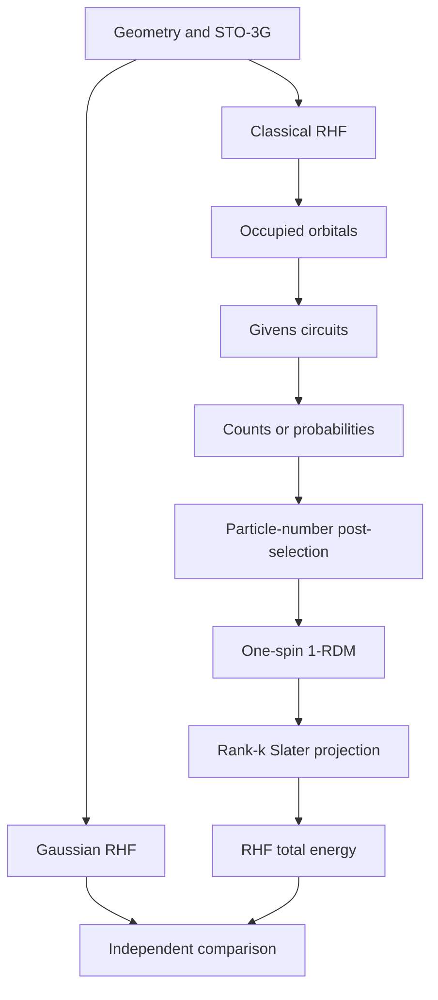

# Reproduction of Hartree–Fock on a Quantum Computer

[](https://www.python.org/)
[](https://doi.org/10.1126/science.abb9811)
[](https://arxiv.org/abs/2004.04174)
[](#选择复现分支)

> End-to-end and auditable reproductions of molecular Hartree–Fock calculations:
> molecular geometry → RHF orbitals → Givens circuits → measured 1-RDM →
> projected Slater determinant → HF total energy → Gaussian/PySCF comparison.

本仓库复现 Arute *et al.* 的工作
[*Hartree-Fock on a superconducting qubit quantum computer*](https://doi.org/10.1126/science.abb9811)。
项目不只给出量子线路，还保留经典分子参考、平台 JSON、Gaussian 输入/输出、
1-RDM 数据处理、有限 shots 统计、误差诊断和自动测试，使最终 Hartree–Fock
能量可以逐步追溯。

> [!IMPORTANT]
> `main` 是总览页，实际代码与数据分别位于四条独立分支，而不是 `main`
> 下的四个目录。克隆后请先切换到目标分支。

## 目录

- [选择复现分支](#选择复现分支)
- [项目复现的完整链路](#项目复现的完整链路)
- [结果概览](#结果概览)
- [快速开始](#快速开始)
- [量子线路与平台约定](#量子线路与平台约定)
- [数据处理](#数据处理)
- [Gaussian 对照](#gaussian-对照)
- [复现标准与结果边界](#复现标准与结果边界)
- [引用](#引用)

## 选择复现分支

| 分支 | 体系与默认模型 | 量子编码 | 测量规模 | 主要内容 |
|---|---|---:|---:|---|
| [`H2-HF-reproduction`](https://github.com/Echomosome/Reproduction-of-Hartree-Fock-on-a-Quantum-Computer/tree/H2-HF-reproduction) | H₂，$R=0.7414$ Å，RHF/STO-3G | 2 qubits，1 particle | 2 settings | 最小校准体系；理想/平台数据、Gaussian、键长扫描 |
| [`H4-HF-reproduction`](https://github.com/Echomosome/Reproduction-of-Hartree-Fock-on-a-Quantum-Computer/tree/H4-HF-reproduction) | 线性 H₄，$R=1.3$ Å，RHF/STO-3G | 4 qubits，2 particles | 4 settings | 含噪模拟与悟空 180 数据、rank-2 投影、bootstrap、shots 规划 |
| [`H8-HF-reproduction`](https://github.com/Echomosome/Reproduction-of-Hartree-Fock-on-a-Quantum-Computer/tree/H8-HF-reproduction) | 线性 H₈，$R=1.3$ Å，RHF/STO-3G | 8 qubits，4 particles | 9 settings | 从解析 STO-3G 积分到分子 RHF 能量的完整闭环与参数审计 |
| [`Diazene-HF-reproduction`](https://github.com/Echomosome/Reproduction-of-Hartree-Fock-on-a-Quantum-Computer/tree/Diazene-HF-reproduction) | 二氮烯 HN=NH，18 个论文印刷几何 | 10 qubits，6 particles | 10 settings/geometry | 两条异构化路径、180 条线路、冻结核误差分解与路径差 bootstrap |

建议按 **H₂ → H₄ → H₈ → 二氮烯** 的顺序阅读：系统规模逐步增加，而
“轨道制备—测量—1-RDM—能量”的主线保持不变。

## 项目复现的完整链路



闭壳层 RHF 的 $\alpha$ 与 $\beta$ 电子占据相同空间轨道，因此量子线路只
编码一个自旋分量。理想单自旋 1-RDM 满足

$$
\gamma^\dagger=\gamma,\qquad
\operatorname{Tr}\gamma=k,\qquad
\gamma^2=\gamma,
$$

其中 $k$ 是该自旋分量的粒子数。对合法 Slater 行列式，RHF 总能量由
1-RDM 唯一确定：

$$
\begin{aligned}
E_{\mathrm{RHF}}[\gamma]
=&\ E_{\mathrm{nuc}}
+2\sum_{pq}h_{pq}\gamma_{pq}\\
&+2\sum_{pqrs}\gamma_{pq}\gamma_{rs}(pq|rs)
-\sum_{pqrs}\gamma_{pq}\gamma_{rs}(pr|qs).
\end{aligned}
$$

这一步依赖 Slater 行列式的 Wick 分解；它不能未经修改地推广到任意相关态。

## 结果概览

| 体系 | 经典 RHF 目标 | 理想量子闭环 | 固定种子有限-shots 示例 |
|---|---:|---:|---:|
| H₂ | $-1.116684387085$ Ha | 机器精度内闭合 | 分支提供可重采样管线 |
| H₄ | $-1.946741626456$ Ha | $\max|\Delta\gamma|=1.87\times10^{-13}$ | 1000 shots/setting：投影后误差 $+0.998$ mHa |
| H₈ | $-3.902579787288$ Ha | $\max|\Delta\gamma|=3.66\times10^{-15}$ | 1000 shots/setting：投影后误差 $+6.504$ mHa |
| 二氮烯 | 18 个固定几何的逐点 RHF | 最大能量闭合误差 $2.84\times10^{-11}$ mHa | 1000 shots/setting：逐点误差 $+5.453$–$+17.493$ mHa |

上表的有限-shots 数字是固定随机种子的管线示例，不是跨设备 benchmark，
也不能替代置信区间。各分支保留了 bootstrap 或 shot-planning 结果：

- H₄ 的单次 1000-shots 点估计进入化学精度，但 95% 区间并未稳定进入；
- H₈ 在理想抽样模型下约需 5000 shots/setting 才能高概率稳定达到
  $1\ \mathrm{kcal/mol}\approx1.594\ \mathrm{mHa}$；
- 二氮烯的 1000-shots 数据可辨别几十 mHa 的路径差异，但不具备逐点化学精度。

## 快速开始

### 1. 克隆并选择分支

```bash
git clone https://github.com/Echomosome/Reproduction-of-Hartree-Fock-on-a-Quantum-Computer.git
cd Reproduction-of-Hartree-Fock-on-a-Quantum-Computer
git switch H2-HF-reproduction
```

将最后一行替换为所需分支名：

```text
H2-HF-reproduction
H4-HF-reproduction
H8-HF-reproduction
Diazene-HF-reproduction
```

### 2. 建立环境

```bash
python -m venv .venv
source .venv/bin/activate
python -m pip install --upgrade pip
python -m pip install -r requirements.txt
```

Windows PowerShell：

```powershell
python -m venv .venv
.\.venv\Scripts\Activate.ps1
python -m pip install --upgrade pip
python -m pip install -r requirements.txt
```

H₂、H₄ 或二氮烯分支仅在需要从几何重新计算 PySCF 参考时，再安装：

```bash
python -m pip install -r requirements-chemistry.txt
```

H₈ 分支自带解析 STO-3G 积分实现，不需要 PySCF。

### 3. 运行目标分支

H₂：

```bash
python tests/run_tests.py
python code/run_demo.py --shots 10000 --bootstrap 2000
```

H₄：

```bash
python tests/run_tests.py
python code/run_demo.py
```

H₈：

```bash
bash run_all.sh
```

Windows 可直接运行：

```powershell
python code/run_all.py
python -m unittest discover -s tests -v
python code/verify_hashes.py
```

二氮烯分支为控制仓库体积，将三类大目录保存为 ZIP。首次运行前先解压：

```bash
unzip data.zip
unzip circuits.zip
unzip results.zip
python tests/run_tests.py
python code/run_demo.py --mode quick --bootstrap 2000
```

若要从 Cartesian 坐标重新生成二氮烯积分、线路和模拟数据：

```bash
python -m pip install -r requirements-chemistry.txt
python code/run_demo.py --mode full --bootstrap 2000
```

## 量子线路与平台约定

所有原生文本线路使用 `X`、`RZ`、`SQISWAP` 和 `MEASURE`；`RZ` 参数均为
**显式弧度**，不要再次乘以 $\pi$。

| 分支 | 默认返回 bit 顺序 | `SQISWAP` 单粒子块 |
|---|---|---|
| H₂ | `q[1]q[0]` | $+i/\sqrt2$ |
| H₄ | `q[3]q[2]q[1]q[0]` | $+i/\sqrt2$ |
| H₈ | `q[7]\ldots q[0]` | $-i/\sqrt2$，按 PyQPanda 约定编译 |
| 二氮烯 | `q[9]\ldots q[0]` | $+i/\sqrt2$ |

> [!WARNING]
> `SQISWAP` 的 $+i/-i$ 号、`RZ` 定义和 bit 顺序属于平台接口的一部分。
> 不同分支或不同后端的角度不能直接互换。提交前应先用两模式校准线路验证
> 门矩阵，并以平台文档或已知 computational-basis 状态确定 bit 顺序。

线路与数据的主要位置：

- `circuits/*`：抽象 Givens、原生门线路、OriginIR/TXT 和 manifest；
- `data/*`：理想概率、有限-shots 示例或平台 JSON；
- `reference/*`：积分、轨道、经典 RHF 与目标 1-RDM；
- `results/*`：重构矩阵、能量、bootstrap、图表与验收结果；
- `gaussian/*`：Gaussian 输入、已有输出和解析说明；
- `tests/*`：门矩阵、测量覆盖、能量闭合与解析器测试。

H₂/H₄ 分支还保留了含噪模拟机和本源悟空 180 的平台结果文件；其中 H₄
`H4-qcir-ver` 对应 1000 次 Monte Carlo 弛豫噪声模拟，记录的单/双量子门
参数均为 0；`H4-qcir-wuk` 对应悟空 180 真机数据。平台数据必须与 shots、
噪声设置、后端和提交时间一起解释。

## 数据处理

各分支的分析程序遵循同一逻辑：

1. 读取并校验 `counts`、`probabilities` 或 `result.key/result.value`；
2. 按平台文档统一 bit 顺序；
3. 归一化并做固定粒子数后选择；
4. 由对角 setting 得到 $\gamma_{pp}=\langle n_p\rangle$；
5. 由干涉 setting 重构实非对角元 $\gamma_{pq}$；
6. 报告 trace、Hermiticity、自然占据数、幂等误差和保留率；
7. 对 $\gamma_{\mathrm{raw}}$ 做 rank-$k$ Slater 投影；
8. 用同一几何的 $h$、ERI 与 $E_{\mathrm{nuc}}$ 计算 raw/projected HF 能量；
9. 通过 multinomial bootstrap 给出能量区间，并与经典参考比较。

rank-$k$ 投影保留 $\gamma_{\mathrm{raw}}$ 最大的 $k$ 个本征子空间：

$$
\gamma_{\mathrm{proj}}
=U\,\operatorname{diag}(\underbrace{1,\ldots,1}_{k},
\underbrace{0,\ldots,0}_{n-k})\,U^\dagger.
$$

raw 1-RDM 在有限 shots 或噪声下可能不幂等，其能量甚至可能低于 RHF；
这不表示量子计算“超过 HF 变分下界”。仓库同时保留 raw 与 projected
结果：前者用于诊断，后者才对应合法 Slater 行列式。

## Gaussian 对照

Gaussian 用作独立经典交叉验证。比较时必须保持：

- 完全相同的 Cartesian 几何与 Å 单位；
- `RHF/STO-3G`；
- 正确的电荷与多重度；
- 含核排斥的总能量；
- Gaussian 输出中的**最后一条** `SCF Done: E(RHF) = ...`；
- 正常终止。

典型 route 为：

```text
#p RHF/STO-3G SCF=(Tight,XQC,MaxCycle=512) NoSymm Pop=Full
```

Gaussian 是许可证软件，仓库不包含可执行程序。各分支提供 `.gjf`、已有
`.out`/`.log`（若存在）及解析器。对二氮烯必须额外区分完整 12 轨道
Gaussian/PySCF RHF、冻结两轨道后的 10 模参考和量子测量误差，不能把三者
的总差异全部归因于量子噪声。

## 复现标准与结果边界

推荐同时报告以下指标，而不是只报告一个能量：

| 层次 | 指标 |
|---|---|
| 电路 | 原生门矩阵闭合误差、测量 pair 覆盖 |
| 守恒 | 粒子数后选择保留率 $P(N=k)$ |
| 1-RDM | trace、自然占据数、幂等误差、Frobenius error |
| Slater 子空间 | projected fidelity |
| 统计 | shots、随机种子、bootstrap 95% 区间 |
| 分子能量 | raw/projected RHF 能量及 mHa 误差 |
| 外部验证 | Gaussian 与 PySCF/解析 RHF 的一致性 |

常用化学精度尺度为

$$
1\ \mathrm{kcal/mol}\approx1.5936\ \mathrm{mHa},
$$

但它不是唯一硬件成功标准。本项目的边界是：

- 复现的是 **restricted Hartree–Fock**，不是 FCI、CCSD 或实验基态能量；
- 这些小体系用于验证量子 HF 数据链，不构成量子优势；
- 理想概率与固定种子采样只能称为模拟闭环；
- 只有保留原始 counts、后端、物理比特映射、校准和 shots，才能称为真机复现；
- 缺少物理映射或读出校准时，只能定位到逻辑线路/矩阵元，不能唯一判定某个
  物理门或比特失效；
- 二氮烯分支直接复现论文 Supplementary Information 中可审计的 9+9 个
  印刷几何，不把离散 9 点结果冒充完整 20 点路径或论文约 $40.2$ mHa 数值。

## 引用

如果本仓库对你的工作有帮助，请引用原始论文：

```bibtex
@article{Arute2020HartreeFock,
  author  = {Arute, Frank and others},
  title   = {Hartree-Fock on a superconducting qubit quantum computer},
  journal = {Science},
  volume  = {369},
  number  = {6507},
  pages   = {1084--1089},
  year    = {2020},
  doi     = {10.1126/science.abb9811}
}
```

主要方法来源：

1. [Science 论文](https://doi.org/10.1126/science.abb9811)
2. [预印本与 Supplementary Information](https://arxiv.org/abs/2004.04174)
3. [Google Quantum AI HFVQE 教程](https://quantumai.google/cirq/experiments/hfvqe)
4. [OpenFermion Slater determinant preparation](https://quantumai.google/reference/python/openfermion/circuits/slater_determinant_preparation_circuit)
5. [PySCF RHF 文档](https://pyscf.org/pyscf_api_docs/pyscf.scf.html)

## License

本仓库当前未包含 `LICENSE` 文件。如需复制、修改或再分发代码与数据，请先
联系仓库作者并确认许可范围。
