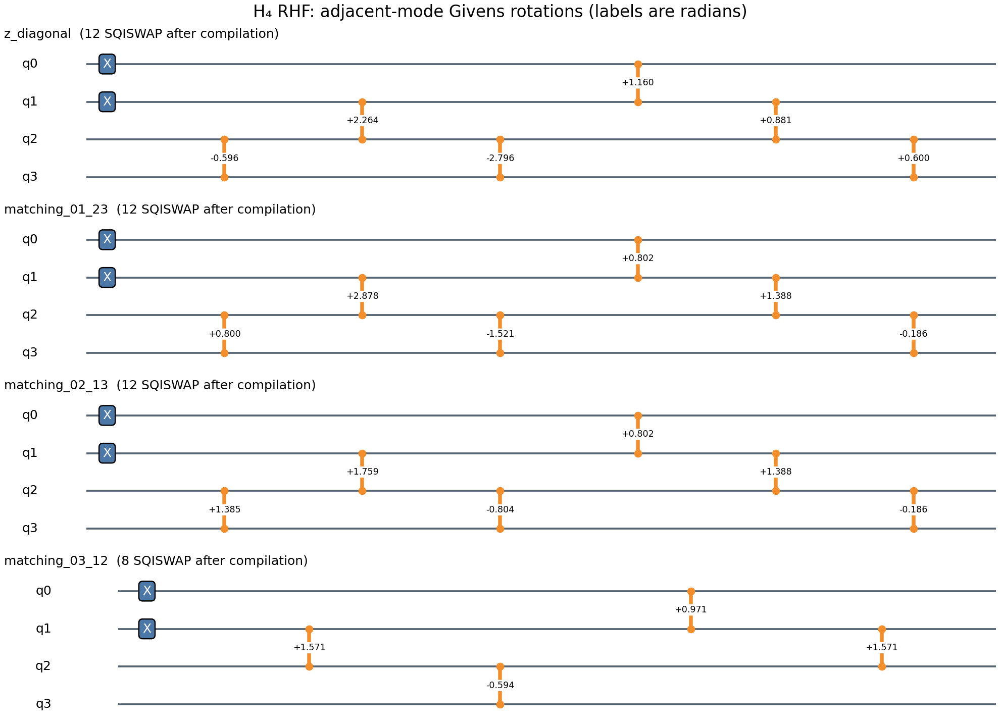

# H₄ Hartree–Fock 量子复现：4 条线路、1‑RDM、HF 能量与 Gaussian 对照

## 一句话结论

这套工程以线性等间距 H₄（默认 \(R=1.3\) Å）为例，用 **4 个量子比特、2 个粒子和 4 条测量线路**重构单自旋 \(4\times4\) 1‑RDM，再用同一套 STO‑3G 分子积分计算 RHF 总能量；理想闭环为

\[
E_{\rm RHF}=-1.946741626456\ {\rm Ha},
\]

并提供可直接提交的 Gaussian 输入、平台 JSON 处理、rank‑2 物理投影、bootstrap、键长扫描和自动测试。

---

## 1. 这套方案复现什么

主闭环是：

\[
\boxed{\text{H₄ 几何 + STO-3G}}
\rightarrow
\boxed{\text{经典 RHF 与分子积分}}
\rightarrow
\boxed{\text{Givens 量子线路}}
\rightarrow
\boxed{\text{4-setting 测量}}
\rightarrow
\boxed{\gamma_Q}
\rightarrow
\boxed{E_{\rm RHF}[\gamma_Q]}
\rightarrow
\boxed{\text{Gaussian RHF 对照}}.
\]

默认定义：

| 项目 | 本工程固定值 |
|---|---|
| 分子 | 线性等间距 H₄ |
| 最近邻 H–H 间距 | \(R=1.3\) Å |
| 坐标 | \(z=(-1.95,-0.65,0.65,1.95)\) Å |
| 电荷/多重度 | `0 1` |
| 方法/基组 | RHF/STO‑3G |
| 轨道基 | Löwdin 正交化 AO 基，\(X=S^{-1/2}\) |
| 主量子编码 | 4 qubits、2 particles，表示一个自旋分量 |
| 初始占据模式 | `q[0]`、`q[1]` |
| 返回 bit 顺序 | `q[3]q[2]q[1]q[0]` |
| 原生门 | `X`、`RZ`、`SQISWAP` |
| RZ 单位 | **弧度** |
| SQISWAP 约定 | 单粒子块为 \(2^{-1/2}\begin{pmatrix}1&i\\i&1\end{pmatrix}\) |

为什么选择 \(R=1.3\) Å：它是所参照氢链工作中的代表性间距，也位于附带的 \(\{0.5,0.9,1.3,1.7,2.1,2.5\}\) Å 扫描点中。它不是 H₄ 的“实验平衡键长”声明，而是用于与 H₆/H₈/H₁₀/H₁₂ 氢链叙事对齐的固定 benchmark。

这不是量子优势实验。H₄ RHF 在经典计算机上极易求解，因此此处的价值是建立一个比 H₂ 更完整、又比 H₈ 更容易调试的量子 HF 校准样例。

---

## 2. 为什么 H₄ 只用 4 个 qubits

STO‑3G 对四个 H 原子提供 4 个空间基函数。中性 H₄ 有 4 个电子，闭壳层 RHF 中：

- 2 个 \(\alpha\) 电子占据两个空间轨道；
- 2 个 \(\beta\) 电子占据相同的两个空间轨道。

所以量子线路只编码一个自旋分量：

\[
4\ \text{空间模式}+2\ \text{同自旋电子}
\Longrightarrow 4\ \text{qubits},\ 2\ \text{particles}.
\]

测得单自旋空间 1‑RDM \(\gamma\) 后，闭壳层能量泛函自动计入两种自旋。若显式编码全部 8 个 spin orbitals，需要 8 个 qubits，但对 RHF 是冗余的。

理想单自旋矩阵满足：

\[
\gamma^\dagger=\gamma,\qquad
\operatorname{Tr}\gamma=2,\qquad
\gamma^2=\gamma.
\]

自然占据数应为：

\[
(0,0,1,1).
\]

---

## 3. 从 Gaussian/PySCF 轨道到量子态

### 3.1 先把 AO 基正交化

Gaussian 与 PySCF 的 AO 基通常不正交：

\[
S_{\mu\nu}=\langle\chi_\mu|\chi_\nu\rangle\neq\delta_{\mu\nu}.
\]

量子比特代表的费米模式必须正交。因此使用 Löwdin 变换：

\[
X=S^{-1/2},\qquad
|\widetilde\chi_p\rangle=\sum_\mu|\chi_\mu\rangle X_{\mu p}.
\]

若 AO 基 MO 系数为 \(C_{\rm AO}\)，则正交基系数为：

\[
C_{\rm orth}=X^{-1}C_{\rm AO}.
\]

前两列是占据轨道 \(C_{\rm occ}\)，目标单自旋 1‑RDM 为：

\[
\gamma_{\rm RHF}=C_{\rm occ}C_{\rm occ}^{T}.
\]

默认几何下：

\[
\gamma_{\rm RHF}\approx
\begin{pmatrix}
0.502608&0.464821&0.001033&-0.184211\\
0.464821&0.497392&0.184211&0.001033\\
0.001033&0.184211&0.497392&0.464821\\
-0.184211&0.001033&0.464821&0.502608
\end{pmatrix}.
\]

完整的 \(S,X,C_{\rm AO},C_{\rm orth},h_{pq},(pq|rs)\) 保存在：

```text
reference/h4_r1.3000_sto3g_reference.json
reference/h4_r1.3000_sto3g_reference.npz
```

### 3.2 Givens 态制备

从参考占据态开始：

```text
X q[0]
X q[1]
```

即每个自旋占据模式 0、1。`z_diagonal` 线路随后按时间顺序施加六个相邻 Givens 旋转：

| 次序 | 旋转 | \(\theta\) / rad |
|---:|---|---:|
| 1 | \(G_{23}\) | -0.595703926501 |
| 2 | \(G_{12}\) | +2.264105378052 |
| 3 | \(G_{23}\) | -2.796042684288 |
| 4 | \(G_{01}\) | +1.160373639687 |
| 5 | \(G_{12}\) | +0.880643874735 |
| 6 | \(G_{23}\) | +0.599545008797 |

这里

\[
G(\theta)=
\begin{pmatrix}
\cos\theta&-\sin\theta\\
\sin\theta&\cos\theta
\end{pmatrix}.
\]

在本工程的 `+i SQISWAP` 约定下，每个实 Givens 编译为：

```text
SQISWAP q[second],q[first]
RZ q[first],(pi + theta)
RZ q[second],(-theta)
SQISWAP q[second],q[first]
RZ q[first],(pi)
```

门文件中已经把所有表达式展开为显式弧度，平台不需要识别 `pi`。

> 角度与几何绑定。改变 \(R\) 会改变 RHF 轨道、Givens 角和四条线路，不能直接复用 \(R=1.3\) Å 的门文件。

---

## 4. 为什么只需 4 条测量线路

实对称 \(4\times4\) 1‑RDM 有：

- 4 个对角元；
- 6 个独立非对角元。

第一条线路直接测全部对角元。余下 6 个元素按完全图 \(K_4\) 的三个 perfect matching 分组，每条线路同时测两个不重叠的轨道对：

| setting | 同时得到 |
|---|---|
| `z_diagonal` | \(\gamma_{00},\gamma_{11},\gamma_{22},\gamma_{33}\) |
| `matching_01_23` | \(\gamma_{01},\gamma_{23}\) |
| `matching_02_13` | \(\gamma_{02},\gamma_{13}\) |
| `matching_03_12` | \(\gamma_{03},\gamma_{12}\) |

对逻辑轨道对 \((i,j)\)，分析器构造对称/反对称组合：

\[
b_L=\frac{a_i+a_j}{\sqrt2},\qquad
b_R=\frac{-a_i+a_j}{\sqrt2}.
\]

于是：

\[
\operatorname{Re}\gamma_{ij}
=\frac{\langle n_L\rangle-\langle n_R\rangle}{2}.
\]

程序把每个“RHF 态制备 \(+\) 测量基变换”整体分解为相邻 Givens，因此即使逻辑对是 \((0,3)\)，输出门文件仍只含相邻 `SQISWAP`。完整映射见：

```text
circuits/measurement_map.csv
circuits/manifest.json
```

四条可直接提交的门文件：

```text
circuits/gate_body_radians/H4-00-z-diagonal.txt
circuits/gate_body_radians/H4-01-matching-01-23.txt
circuits/gate_body_radians/H4-02-matching-02-13.txt
circuits/gate_body_radians/H4-03-matching-03-12.txt
```

带 `QINIT/CREG/MEASURE` 的完整 OriginIR 位于：

```text
circuits/originir_full/
```



---

## 5. 如何由 1‑RDM 得到 Hartree–Fock 能量

本工程的 \(\gamma\) 是单自旋空间 1‑RDM。闭壳层 RHF 总能量为：

\[
\begin{aligned}
E_{\rm RHF}[\gamma]
=&\ E_{\rm nuc}
+2\sum_{pq}h_{pq}\gamma_{qp}\\
&+2\sum_{pqrs}\gamma_{pq}\gamma_{rs}(pq|rs)
-\sum_{pqrs}\gamma_{pq}\gamma_{rs}(pr|qs).
\end{aligned}
\]

默认几何的经典闭环：

| 能量项 | 数值 / Ha |
|---|---:|
| 核排斥 \(E_{\rm nuc}\) | +1.763924036400 |
| 一电子项 | -5.771939065971 |
| Coulomb 项 | +3.215414099678 |
| exchange 项（被减去） | +1.154140696563 |
| RHF 总能量 | **-1.946741626456** |

程序同时输出：

- `raw`：直接把线性重构的 \(\gamma_{\rm raw}\) 代入泛函；
- `rank-2 projected`：保留 \(\gamma_{\rm raw}\) 最大的两个本征子空间，构造最近的 rank‑2 Slater projector 后计算。

有限 shots 或噪声会使 raw 矩阵不再幂等。raw 能量甚至可能低于 RHF 参考；这不代表“超过 HF”，因为 RHF 变分界只约束合法 Slater 行列式。主分子能量指标应使用 rank‑2 投影值，同时保留 raw 值用于诊断。

---

## 6. 目录结构

```text
H4_HF_Reproduction/
├── README.md
├── requirements.txt
├── requirements-chemistry.txt
├── code/
│   ├── h4_core.py
│   ├── build_reference.py
│   ├── generate_circuits.py
│   ├── simulate_data.py
│   ├── analyze_results.py
│   ├── shot_planning.py
│   ├── scan_curve.py
│   ├── generate_gaussian_inputs.py
│   ├── parse_gaussian.py
│   ├── make_circuit_figure.py
│   └── run_demo.py
├── circuits/
│   ├── gate_body_radians/
│   ├── originir_full/
│   ├── manifest.json
│   └── measurement_map.csv
├── data/
│   ├── example_ideal_probabilities/
│   ├── example_1000_shots/
│   └── platform_json_template.json
├── reference/
│   ├── h4_r1.3000_sto3g_reference.json
│   └── h4_r1.3000_sto3g_reference.npz
├── gaussian/
│   ├── RUN_GAUSSIAN.md
│   ├── inputs/
│   └── scan_inputs/
├── figures/
├── results/
│   ├── ideal/
│   ├── sample_1000_shots/
│   ├── shot_planning/
│   └── scan/
└── tests/
    └── run_tests.py
```

---

## 7. 从零开始运行

所有命令均在材料包根目录执行。

### Step 1：建立 Python 环境

Linux/macOS：

```bash
python -m venv .venv
source .venv/bin/activate
python -m pip install -r requirements.txt
```

Windows PowerShell：

```powershell
python -m venv .venv
.\.venv\Scripts\Activate.ps1
python -m pip install -r requirements.txt
```

基础分析只需 NumPy 与 Matplotlib。若要从头重算积分和 RHF：

```bash
python -m pip install -r requirements-chemistry.txt
```

### Step 2：先运行测试

```bash
python tests/run_tests.py
```

应看到 5 个测试全部 `ok`：

1. PySCF RHF 能量与 1‑RDM 泛函闭合；
2. 三个 matching 恰好覆盖 6 个非对角元；
3. 四条原生门线路在机器精度内得到目标测量基；
4. 理想 JSON 精确重构 1‑RDM 和能量；
5. rank‑2 投影与 Gaussian `SCF Done` 解析正确。

### Step 3：一键重建 demo

包中已带预计算参考，因此无需 PySCF：

```bash
python code/run_demo.py
```

它会重新生成线路、Gaussian 输入、理想概率、1000-shots 样例、图表和统计结果。

### Step 4：从头生成分子参考（需要 PySCF）

```bash
python code/build_reference.py \
  --spacing 1.3 \
  --output-npz reference/h4_r1.3000_sto3g_reference.npz \
  --output-json reference/h4_r1.3000_sto3g_reference.json
```

然后重新生成线路：

```bash
python code/generate_circuits.py
```

---

## 8. 处理你自己的平台数据

### 8.1 需要哪四份结果

把平台返回文件放入同一个目录，例如：

```text
data/my_hardware_run/
├── z_diagonal.json
├── matching_01_23.json
├── matching_02_13.json
└── matching_03_12.json
```

文件名必须与 setting 一致。程序支持：

- `counts` 字典；
- `probabilities` 字典；
- `result.key` + `result.value` 数组；
- 明确的 `shots`；
- 可从概率网格推断的 shots。

模板见：

```text
data/platform_json_template.json
```

### 8.2 运行分析

如果 JSON 中含 shots：

```bash
python code/analyze_results.py \
  --input-dir data/my_hardware_run \
  --bootstrap 2000 \
  --output-dir results/my_hardware_run
```

如果平台只给概率而未写 shots：

```bash
python code/analyze_results.py \
  --input-dir data/my_hardware_run \
  --shots 5000 \
  --bootstrap 2000 \
  --output-dir results/my_hardware_run
```

如果平台返回左到右是 `q[0]q[1]q[2]q[3]`：

```bash
python code/analyze_results.py \
  --input-dir data/my_hardware_run \
  --bit-order q0q1q2q3 \
  --shots 5000 \
  --bootstrap 2000 \
  --output-dir results/my_hardware_run
```

### 8.3 程序实际执行的处理顺序

#### A. JSON 校验

逐文件检查：

1. `status` 若存在必须为 `Completed`；
2. bitstring 必须恰为 4 位；
3. 概率/counts 非负且有限；
4. 分布总和为正；
5. key/value 数量匹配；
6. shots 元数据或概率网格可解释。

#### B. bit 顺序

默认：

```text
"0011" -> q[0]=1, q[1]=1, q[2]=0, q[3]=0
```

即左到右为 `q[3]q[2]q[1]q[0]`。

#### C. 粒子数后选择

单自旋 H₄ 必须有两个粒子。只保留 Hamming weight 为 2 的：

```text
0011, 0101, 0110, 1001, 1010, 1100
```

保留率：

\[
P(N=2)=\sum_{b:\,|b|=2}p(b).
\]

低保留率会减小有效 shots，并提示读出、门误差或 bit 映射问题。程序不会静默删除泄漏，而会把每条线路的保留率写入 `setting_summary.csv`。

#### D. 重构对角元

由 `z_diagonal`：

\[
\gamma_{pp}=\langle n_p\rangle.
\]

#### E. 重构非对角元

由三个 matching：

\[
\gamma_{ij}=\frac{\langle n_L\rangle-\langle n_R\rangle}{2}.
\]

#### F. rank‑2 物理投影

对 \(\gamma_{\rm raw}\) 对称化并对角化，取最大的两个本征向量 \(v_1,v_2\)：

\[
\gamma_{\rm proj}=v_1v_1^\dagger+v_2v_2^\dagger.
\]

#### G. 计算能量

分别计算：

```text
E_raw  = E_RHF[gamma_raw]
E_proj = E_RHF[gamma_projected_rank2]
```

#### H. bootstrap

每条 setting 按原始分布和 shots 做 multinomial 重采样；每个样本都重新执行后选择、1‑RDM 重构、rank‑2 投影和能量计算。输出 measured bootstrap 与“理想线路在相同 shots 下”的统计包络。

---

## 9. 输出文件怎么读

主要结果位于指定的 `--output-dir`：

| 文件 | 内容 |
|---|---|
| `summary.json` | 全部输入、1‑RDM、能量、bootstrap 与 PASS/FAIL |
| `setting_summary.csv` | 每条线路 shots、\(P(N=2)\)、TV 距离 |
| `gamma_raw.csv` | 线性重构 1‑RDM |
| `gamma_projected_rank2.csv` | 最近 rank‑2 Slater 1‑RDM |
| `gamma_reference.csv` | 经典 RHF 目标 |
| `energy_summary.csv` | PySCF/raw/projected/Gaussian 能量 |
| `bootstrap_measured.csv` | 围绕实测分布重采样 |
| `bootstrap_ideal_shot_model.csv` | 理想线路的有限 shots 包络 |
| `gamma_comparison.png` | 参考、raw、投影及差值热图 |
| `energy_comparison.png` | 相对 RHF 的 mHa 误差 |

推荐先看：

```text
summary.json -> acceptance
energy_summary.csv
setting_summary.csv
gamma_comparison.png
```

---

## 10. 包内示例结果

### 10.1 理想概率闭环

`data/example_ideal_probabilities/` 得到：

| 指标 | 结果 |
|---|---:|
| \(\max|\gamma_Q-\gamma_{\rm RHF}|\) | \(1.87\times10^{-13}\) |
| \(\|\gamma_Q^2-\gamma_Q\|_F\) | \(1.38\times10^{-13}\) |
| 单自旋 Slater fidelity | 1.000000 |
| \(E_{\rm raw}\) / Ha | -1.946741626456 |
| \(E_{\rm proj}\) / Ha | -1.946741626456 |

### 10.2 固定种子的 1000-shots 样例

`data/example_1000_shots/` 使用 seed `5210`：

| 指标 | 结果 |
|---|---:|
| 最低 \(P(N=2)\) | 1.000 |
| 四 setting 平均 TV | 0.017103 |
| \(\|\gamma_{\rm raw}-\gamma_{\rm RHF}\|_F\) | 0.036336 |
| \(\|\gamma_{\rm raw}^2-\gamma_{\rm raw}\|_F\) | 0.013592 |
| 单自旋 Slater fidelity | 0.999425 |
| \(E_{\rm raw}\) / Ha | -1.932043175319 |
| raw 误差 / mHa | +14.698 |
| \(E_{\rm proj}\) / Ha | -1.945743767529 |
| projected 误差 / mHa | **+0.998** |

这个单次点估计落在常用化学精度 \(1\) kcal/mol \(\approx1.594\) mHa 内，但 1000 shots 的 95% 统计区间并不完全落在化学精度内。因此正确结论是：

> 1000 shots 足以演示 H₄ 的线路和 1‑RDM 闭环，也可能得到化学精度内的点估计；若要在理想统计模型下以 95% 置信度稳定达到化学精度，建议每条 setting 至少约 5000 shots。

包内 `code/shot_planning.py` 会重新估计 shots 需求。默认结果：

| shots/setting | projected 能量误差 97.5% 分位 / mHa | 95% 化学精度 |
|---:|---:|---|
| 1000 | 约 3.5 | 否 |
| 2000 | 约 1.6 | 临界 |
| 5000 | 约 0.7 | 是 |
| 10000 | 约 0.3 | 是 |

这些只是理想 multinomial 统计估计；真机系统误差不会自动随 shots 增加而消失。

---

## 11. Gaussian 怎么跑、比较什么

### 11.1 默认 Gaussian 输入

```text
gaussian/inputs/h4_R1p3000_RHF_STO3G.gjf
```

核心内容：

```text
%chk=h4_R1p3000_RHF_STO3G.chk
%nprocshared=4
%mem=2GB
#p RHF/STO-3G SCF=(Tight,XQC,MaxCycle=512) NoSymm Pop=Full

Linear H4, nearest-neighbour spacing R=1.3000 Angstrom

0 1
H   0.0000000000   0.0000000000  -1.9500000000
H   0.0000000000   0.0000000000  -0.6500000000
H   0.0000000000   0.0000000000   0.6500000000
H   0.0000000000   0.0000000000   1.9500000000
```

### 11.2 提交

进入 `gaussian/`：

```bash
g16 < inputs/h4_R1p3000_RHF_STO3G.gjf \
  > h4_R1p3000_RHF_STO3G.log
```

确认：

```bash
grep "SCF Done" h4_R1p3000_RHF_STO3G.log
grep "Normal termination" h4_R1p3000_RHF_STO3G.log
```

Windows 可在文本编辑器中搜索相同关键词。

### 11.3 解析 Gaussian

从材料包根目录：

```bash
python code/parse_gaussian.py \
  gaussian/h4_R1p3000_RHF_STO3G.log
```

或在量子数据分析时直接加入：

```bash
python code/analyze_results.py \
  --input-dir data/my_hardware_run \
  --gaussian-log gaussian/h4_R1p3000_RHF_STO3G.log \
  --shots 5000 \
  --bootstrap 2000 \
  --output-dir results/my_hardware_run
```

### 11.4 应该比较什么

最直观、最稳妥的主指标是同一几何、基组和 RHF 定义下的**总 SCF 能量**：

\[
\Delta E_Q=E_{\rm proj}-E_{\rm Gaussian}^{\rm RHF}.
\]

推荐同时报告：

1. Gaussian/PySCF RHF 参考能量；
2. 量子 raw 能量；
3. 量子 rank‑2 投影能量；
4. \(\Delta E\) 的 bootstrap 95% 区间；
5. \(P(N=2)\)、1‑RDM Frobenius 误差、幂等误差和 Slater fidelity。

默认 PySCF 参考为：

```text
-1.946741626456 Ha
```

Gaussian 的最终 `SCF Done` 应与它在通常打印精度内一致。当前制作环境没有 Gaussian 许可证，因此材料包没有伪造 Gaussian 实跑日志；只提供输入、解析器和预期的独立 PySCF 基准。

不要直接把量子 RHF 能量与 FCI 能量当作同一目标比较。当前线路只制备单一 Slater 行列式，正确的第一基准是 RHF。

### 11.5 Gaussian 密度矩阵的注意事项

Gaussian 输出的 AO 密度通常是自旋求和的 4 电子矩阵，而量子 \(\gamma_Q\) 是单自旋、trace 为 2 的正交基矩阵。若以后比较 1‑RDM，必须：

1. 把 Gaussian spin-summed AO density 除以 2；
2. 用同一 \(S^{-1/2}\) 变换到 Löwdin 正交基；
3. 对齐 AO/轨道顺序和整体轨道子空间。

直接比较 Gaussian AO 密度的普通矩阵元素与量子 \(\gamma_Q\) 是错误的。

---

## 12. 键长扫描

Gaussian 输入已包含：

```text
R = 0.5, 0.9, 1.3, 1.7, 2.1, 2.5 Å
```

位于：

```text
gaussian/scan_inputs/
```

PySCF 扫描：

```bash
python code/scan_curve.py
```

若 Gaussian 日志集中放在 `gaussian/scan_logs/`：

```bash
python code/scan_curve.py \
  --gaussian-log-dir gaussian/scan_logs \
  --output-dir results/scan
```

输出势能曲线：

```text
results/scan/h4_rhf_sto3g_curve.csv
results/scan/h4_rhf_sto3g_curve.png
```

对每个 \(R\) 做量子运行的正确流程是：

```text
R
 -> build_reference.py
 -> generate_circuits.py
 -> 提交该 R 的四条线路
 -> analyze_results.py
 -> 与该 R 的 Gaussian SCF Done 比较
```

不能用一套 \(R=1.3\) Å 线路测完整势能曲线。

---

## 13. 成功标准

工程在 `summary.json -> acceptance` 中分层判断：

| 层级 | 指标 | 建议标准 |
|---|---|---|
| 输入 | 任务完成、JSON 合法 | 必须通过 |
| 守恒 | 每条 \(P(N=2)\) | \(\ge 0.95\) |
| 统计 | 平均 TV 不超过同 shots 理想模型 97.5% 分位 | 通过 |
| Slater 子空间 | 单自旋 fidelity | \(\ge0.99\) |
| 能量点估计 | \(|E_{\rm proj}-E_{\rm RHF}|\) | \(\le1.594\) mHa |
| 严格能量 | 95% 区间整体在化学精度内 | 推荐最终标准 |
| Gaussian | Gaussian 与 PySCF RHF | 打印精度内一致 |

程序同时给：

- `overall_point_estimate_pass`；
- `overall_molecular_reproduction_pass`。

后者更严格，要求 projected 能量的 95% 区间也完整进入化学精度范围。

---

## 14. 常见故障

### 能量完全不对，但粒子数正确

优先检查：

1. `RZ` 是否被误当成 \(\theta/\pi\)，本工程要求**弧度**；
2. `SQISWAP` 是 `+i` 还是 `-i` 约定；
3. bit 顺序是否为 `q3q2q1q0`；
4. 是否把四份结果与错误的 setting 文件对应；
5. 分子几何和参考积分是否都是 \(R=1.3\) Å。

### raw 能量比 RHF 更低

先看：

```text
gamma_raw_metrics -> idempotency_frobenius
natural_occupations
```

raw 矩阵若非幂等，不受 RHF 变分界约束。查看 rank‑2 投影结果，不要把非物理 raw 能量包装成更好的量子结果。

### \(P(N=2)\) 很低

这通常不是有限 shots 本身造成，而是：

- 读出误差；
- 门误差/弛豫；
- bit 映射错误；
- 线路编译或 qubit mapping 错误。

建议同时保存：

- 原始 counts；
- 物理 qubit 映射；
- 同时刻读出校准矩阵；
- T1/T2；
- 单/双比特门保真度；
- shots 和任务时间。

### Gaussian 与 PySCF 差异较大

检查：

- 是否同为 `RHF/STO-3G`；
- 电荷/多重度是否 `0 1`；
- 四个坐标和单位是否一致；
- 是否拿了优化前或其他 Link1 段的 `SCF Done`；
- Gaussian 是否正常终止；
- 是否误用 UHF、DFT 或不同基组。

---

## 15. 方法依据

- Rubin et al., *Hartree-Fock on a superconducting qubit quantum computer*, Science 369, 1084–1089 (2020), DOI: `10.1126/science.abb9811`.
- Google Quantum AI HFVQE tutorial：`https://quantumai.google/cirq/experiments/hfvqe`
- PySCF SCF API：`https://pyscf.org/pyscf_api_docs/pyscf.scf.html`
- Gaussian HF keyword：`https://gaussian.com/hf/`

本工程把论文中的“Givens 基变换 + 1‑RDM 测量”缩小到 H₄，并增加了同基分子积分、HF 能量、Gaussian 独立基准、物理投影和 finite-shot 验收。
